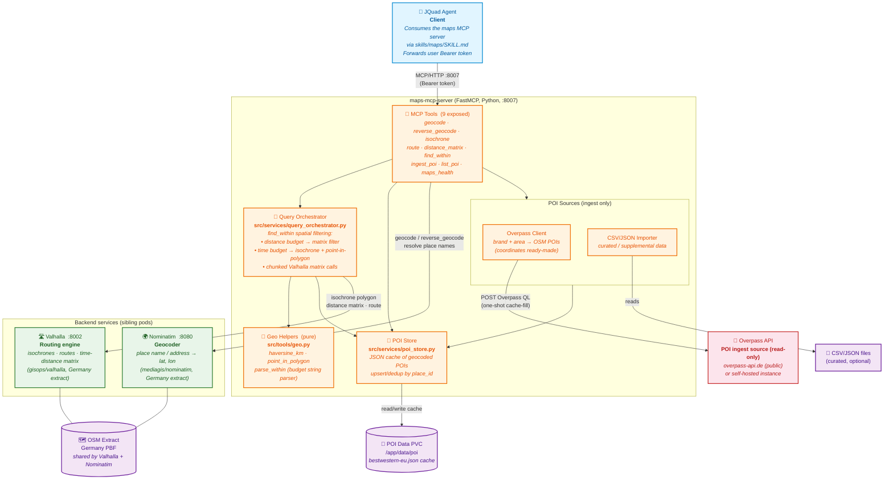

# Maps MCP Server

An MCP server providing **geocoding**, **routing**, **isochrones** and
**POI-by-proximity** search. Answers natural-language questions like:

> *"Give me all Best Western hotels within 50 km of Nuremberg."*
> *"Give me all Best Western hotels an hour's drive from Nuremberg."*

It runs on top of two **self-hosted, free, OpenStreetMap-based** backends:

- **Valhalla** — routing engine for driving routes, isochrones (areas
  reachable within X minutes), and time/distance matrices.
- **Nominatim** — geocoder turning place names / addresses into coordinates.

The POIs it searches over default to the **Best Western Europe** hotel set,
loaded from **OpenStreetMap** via Overpass (coordinates come ready-made
from OSM — no geocoding step). A curated CSV/JSON file can also be
imported to supplement OSM coverage. Any ad-hoc list of places can be
passed to a query.

---

## Why these backends (and not Google Maps)

| Need | This server | Google Maps |
|---|---|---|
| "an hour away" (isochrone) | ✅ native Valhalla isochrone | ⚠️ requires distance-matrix hacks |
| self-hostable, free | ✅ both pods in your cluster | ❌ paid, external |
| no per-query cost | ✅ | ❌ |
| POI source | OpenStreetMap (free, community-mapped) | Places API (paid) |

Google Maps' "official" MCP server is experimental, and isochrones aren't a
first-class capability there. For the "an hour's drive" question, a real
routing engine is required — a circle on a map is wrong.

---

## Architecture



**How a query flows** — *"Best Western hotels an hour's drive from Nuremberg"*:

1. The **Agent** calls `find_within(center="Nuremberg", within="1 hour")` over MCP/HTTP.
2. **Query Orchestrator** resolves "Nuremberg" via **Nominatim** → coordinates.
3. It requests a 60-min **isochrone polygon** from **Valhalla**.
4. It tests each **POI Store** coordinate against the polygon (`Geo Helpers`).
5. For matches, one **Valhalla** matrix call returns each hotel's driving duration.
6. Result returned — **one** Valhalla round trip regardless of POI count.

**How ingestion works** — populating the cache (one-shot, at deploy time):

1. **Agent** (or an admin) calls `ingest_poi(source="overpass")`.
2. **Overpass Client** sends one Overpass QL query to the **Overpass API**.
3. Returned OSM hotels (coordinates ready-made) are written to the **POI Store** → **POI Data PVC**.
4. Thereafter, `find_within` reads only from the cache — **zero Overpass dependency at query time**.

| Component | Responsibility |
|---|---|
| **maps-mcp-server** | Single home for everything geo. Exposes 9 MCP tools; orchestrates the backends. |
| **Query Orchestrator** | The `find_within` brain: decides isochrone-vs-matrix, filters POIs, chunks matrix calls. |
| **Geo Helpers** | Pure spatial math (haversine, point-in-polygon, budget parsing). No I/O. |
| **POI Store** | JSON cache of geocoded POIs on a PVC. The query path's only data source. |
| **Overpass Client / CSV Importer** | Ingest-only adapters that populate the POI Store (not on the query path). |
| **Nominatim** | Geocoding: place names → coordinates (Nuremberg → 49.45, 11.08). |
| **Valhalla** | Routing: isochrones, routes, time-distance matrices. The "an hour away" engine. |
| **Overpass API** | Read-only source of POI coordinates from OpenStreetMap. Contacted only at ingest time. |
| **OSM Extract** | The same Germany PBF shared by Nominatim and Valhalla for consistent coordinates. |

The maps server is the single home for everything geo. The POI cache is
persisted on a PVC at `/app/data/poi`. Overpass is only contacted at
**ingest time** (a one-shot cache-fill); `find_within` reads the cache at
query time with zero Overpass dependency.

---

## The 9 MCP tools

| Tool | Purpose |
|---|---|
| `find_within` | **Headline tool.** POIs within a distance or time budget of a center. |
| `route` | Point-to-point driving distance + duration. |
| `distance_matrix` | Batch one-to-many / many-to-many times + distances. |
| `isochrone` | The "reachable within X minutes" polygon. |
| `geocode` | Place name / address → coordinates. |
| `reverse_geocode` | Coordinates → address. |
| `list_poi` | Dump the ingested POI cache. |
| `ingest_poi` | Admin: load hotels from OpenStreetMap (Overpass) or a curated file → cache. |
| `maps_health` | Internal: backend health check. |

Full tool documentation is in [`jquad-ai-assistant-agent/skills/maps/SKILL.md`](../jquad-ai-assistant-agent/skills/maps/SKILL.md).

### How `find_within` works (the key correctness point)

The `within` string decides the operation:

- **Distance** (`"50 km"`, `"30 miles"`): one Valhalla `sources_to_targets`
  call (road distance — what users mean). `metric="crow"` falls back to
  great-circle haversine.
- **Time** (`"1 hour"`, `"45 min"`): one Valhalla isochrone polygon +
  point-in-polygon membership, plus a matrix call so each match also reports
  its actual driving duration.

Every query costs at most **one** Valhalla round trip (plus optionally one
isochrone), regardless of how many POIs are evaluated.

---

## Quick start (local dev)

```bash
# 1. Install deps
uv sync

# 2. Run tests (no network needed — httpx is mocked)
uv run pytest

# 3. Boot the server (backends unreachable in dev, but tools are live)
OTEL_SDK_DISABLED=true uv run python -m src.server
# → http://127.0.0.1:8007/mcp
```

For full local functionality you need Valhalla + Nominatim running. The
easiest way is the official docker images:

```bash
# Valhalla — download Germany extract, build tiles (one-time, ~20 min)
docker run -d --name valhalla -p 8002:8002 \
  -v $(pwd)/valhalla-data:/data/valhalla \
  -e serve_tiles=true gisops/valhalla:latest
# Inside the container:
#   wget -O /data/valhalla/germany-latest.osm.pbf \
#     https://download.geofabrik.de/europe/germany-latest.osm.pbf
# Valhalla rebuilds tiles on next start.

# Nominatim — imports Germany on first boot (~30-60 min)
docker run -d --name nominatim -p 8080:8080 \
  -e PBF_URL=https://download.geofabrik.de/europe/germany-latest.osm.pbf \
  -v $(pwd)/nominatim-data:/var/lib/postgresql/14/main \
  mediagis/nominatim:4.3
```

Then point the server at them:

```bash
export VALHALLA_URL=http://localhost:8002
export NOMINATIM_URL=http://localhost:8080
uv run python -m src.server
```

---

## Configuration

All config is via environment variables (read once at startup by
`MapsSettings.from_env()`):

| Variable | Default | Description |
|---|---|---|
| `PORT` | `8007` | HTTP listen port. |
| `LOG_LEVEL` | `INFO` | Logging level. |
| `VALHALLA_URL` | `http://valhalla.teams.svc.cluster.local:8002` | Valhalla base URL. |
| `NOMINATIM_URL` | `http://nominatim.teams.svc.cluster.local:8080` | Nominatim base URL. |
| `NOMINATIM_RATE_LIMIT_RPS` | `5.0` | Max Nominatim req/sec (1/rps = min interval). |
| `NOMINATIM_USER_AGENT` | `jquad-maps-mcp` | User-Agent header. |
| `OVERPASS_URL` | `https://overpass-api.de/api/interpreter` | Overpass endpoint for POI ingest. Self-host or use a paid mirror for production. |
| `OVERPASS_TIMEOUT` | `90.0` | Per-request Overpass timeout (Europe brand queries can be slow). |
| `POI_DATA_PATH` | `./data/poi` | Directory for ingested POI JSON caches. |
| `POI_DEFAULT_COLLECTION` | `bestwestern-eu` | Default collection for `find_within` / `list_poi`. |
| `POI_DEFAULT_BRAND` | `Best Western` | Default brand for `ingest_poi(source="overpass")`. |
| `POI_DEFAULT_AREA` | `europe` | Default geographic scope for Overpass ingest (`europe`, a country code, a list, or a bbox). |
| `MAX_MATRIX_SIZE` | `50` | Max destinations per Valhalla matrix call (chunked above this). |
| `HTTP_TIMEOUT_SECONDS` | `30.0` | Outbound HTTP total timeout. |
| `HTTP_CONNECT_TIMEOUT` | `10.0` | Outbound connect timeout. |
| `KEYCLOAK_ENABLED` | `false` | Optional JWT validation (agent forwards token regardless). |
| `OTEL_EXPORTER_OTLP_ENDPOINT` | *(OTel default)* | OTLP gRPC endpoint for tracing. |
| `OTEL_SERVICE_NAME` | `maps-mcp-server` | Service name in traces. |

---

## How to call the MCP server directly

The MCP protocol requires a Streamable HTTP handshake. Example:

```bash
# 1. Initialize session
INIT=$(curl -s -D /tmp/h -X POST http://localhost:8007/mcp \
  -H "Content-Type: application/json" \
  -H "Accept: application/json, text/event-stream" \
  -d '{"jsonrpc":"2.0","method":"initialize","params":{"protocolVersion":"2025-03-26","capabilities":{},"clientInfo":{"name":"test","version":"1.0"}},"id":"init"}')
SID=$(grep -i mcp-session-id /tmp/h | tr -d '\r' | awk '{print $2}')

# 2. Call a tool (geocode Nuremberg)
curl -s -X POST http://localhost:8007/mcp \
  -H "Content-Type: application/json" \
  -H "Accept: application/json, text/event-stream" \
  -H "Mcp-Session-Id: $SID" \
  -d '{"jsonrpc":"2.0","method":"tools/call","params":{"name":"geocode","arguments":{"query":"Nuremberg"}},"id":"1"}'
```

---

## End-to-end: the headline query

After deploying and ingesting the hotel set:

```bash
# 1. Ingest (one-time / on refresh) — Best Western, all of Europe, from OSM
#    tools/call ingest_poi {source: "overpass"}
# → {"source": "overpass", "collection": "bestwestern-eu", "ingested": 180, "total": 180}

# 2. Ask: Best Western within 1 hour of Nuremberg
#    tools/call find_within {center: "Nuremberg", within: "1 hour"}
```

The server:
1. Geocodes "Nuremberg" → 49.4521, 11.0767 (Nominatim).
2. Requests a 60-minute isochrone polygon around it (Valhalla).
3. Tests each cached hotel coordinate against the polygon
   (point-in-polygon).
4. For each hotel inside, calls the Valhalla matrix for its actual driving
   duration (so it can say "43 min away", not just "inside the zone").
5. Returns the matches sorted shortest-duration-first.

```json
{
  "budget": {"kind": "time", "human": "1 hour", "raw": "1 hour"},
  "center": {"lat": 49.4521, "lon": 11.0767, "display_name": "Nürnberg, Bayern, Germany"},
  "matches": [
    {
      "name": "Best Western Premier Nürnberg City Center",
      "address": "...",
      "lat": 49.45, "lon": 11.07,
      "time_seconds": 600, "time_minutes": 10.0,
      "inside_isochrone": true,
      "source_url": "osm://node:12345"
    }
  ],
  "match_count": 1,
  "total_evaluated": 180
}
```

(Exact match counts and durations depend on real OSM data and driving
times at query time.)

---

## POI ingestion pipeline

The `ingest_poi` tool loads hotels from one of two sources:

### OpenStreetMap via Overpass (default)

`ingest_poi(source="overpass", brand="Best Western", area="europe")`:

1. Builds an Overpass QL query for every feature tagged
   `brand~"Best Western"` inside the area (Europe bbox by default).
2. Sends one POST to the Overpass endpoint.
3. Parses each returned element into a POI with **coordinates already
   attached** (no geocoding step — OSM nodes carry lat/lon).
4. Extracts optional `addr:*`, `phone`, `website`, `brand`, `stars` tags.
5. Upserts into `<collection>.json` keyed by `sha1(osm_type:osm_id)` —
   idempotent, so re-fetching updates records in place.

The public Overpass instances are rate-limited, so treat ingest as a
**one-shot cache-fill at deploy time**, not a per-query call. For steady
traffic, self-host Overpass and point `OVERPASS_URL` at it.

### Curated CSV / JSON file

`ingest_poi(source="csv:/app/data/hotels.csv")`:

```
name,lat,lon,street,housenumber,postcode,city,country,phone,website,brand
Best Western Premier Nürnberg City Center,49.4521,11.0767,Koenigstr.,33,90402,Nuremberg,DE,+49 911 206890,https://...,Best Western
```

CSV headers are case-insensitive; only `name,lat,lon` are required. Use
this to curate a checked-in list, or to supplement OSM where coverage is
thin. A JSON file (a list of objects with the same keys) is also accepted.

Re-running `ingest_poi` updates existing entries; it never duplicates.

---

## Deployment (Kubernetes)

```bash
# Build + push (from jquad-ai-assistant-agent/deployment/scripts/)
./build-and-push-all.sh --project jquad-agent-maps-mcp-server

# Deploy to the teams namespace
kubectl apply -k k8s/overlays/teams
```

### One-time data setup (Valhalla + Nominatim)

Both backends need an OSM extract. On first boot:

- **Valhalla**: download the Germany PBF into the `valhalla-data` PVC, then
  restart the pod — it builds routing tiles (10-30 min for Germany).
- **Nominatim**: set `PBF_URL` in the manifest (already done); the
  `mediagis/nominatim` image imports automatically on first boot
  (30-60 min, ~3-4 GB RAM).

Subsequent restarts are instant (data is on the PVCs). Both backends use the
**same Germany extract** so coordinates are consistent. Switch to the Europe
extract later by changing `PBF_URL` and the Valhalla download.

### Populate the hotel cache

After the maps server pod is up, populate the POI cache from OpenStreetMap:

```bash
# Via MCP API (from inside the cluster) or a chat request:
ingest_poi(source="overpass", brand="Best Western", area="europe")
# → fetches ~150-200 Best Western hotels across Europe from OSM,
#   caches them on the maps-mcp-poi-data PVC.
```

This is a one-shot cache-fill. To supplement OSM coverage, also import a
curated CSV:

```bash
ingest_poi(source="csv:/app/data/hotels.csv")
```

If you self-host Overpass, set `OVERPASS_URL` in the configmap first.

---

## Testing

```bash
uv run pytest                          # all tests
uv run pytest tests/test_geo.py -v     # spatial helpers only
uv run pytest --cov=src                # with coverage
```

The test suite (128 tests) covers:

- **`test_geo.py`** — haversine, point-in-polygon (with holes), the
  `parse_within` budget parser (distance + time + edge cases).
- **`test_poi_store.py`** — JSON cache upsert/dedup/delete, UTF-8, path
  sanitization (no traversal).
- **`test_overpass_client.py`** — Overpass QL query builder (Europe bbox,
  country codes, brand regex widening), element parsing (node + way center,
  dedup, unnamed-skip), httpx wire format mocked via `respx` including
  rate-limit (429) and gateway-timeout (504) handling.
- **`test_csv_importer.py`** — CSV/JSON import (case-insensitive headers,
  BOM, TSV, coordinate validation, missing-column errors), the
  `overpass_to_poi` converter, and the `import_file` extension dispatcher.
- **`test_nominatim_client.py`** / **`test_valhalla_client.py`** — httpx
  wire format mocked via `respx`.
- **`test_query_orchestrator.py`** — the `find_within` spatial filtering for
  both distance and time budgets, with matrix chunking and isochrone
  polygon membership.

---

## Related components

| Component | Role |
|---|---|
| **jquad-ai-assistant-agent** | Orchestrator; consumes this server via `skills/maps/SKILL.md`. |
| **OpenStreetMap / Overpass** | Source of POI data (Best Western hotels) — coordinates ready-made, no geocoding needed. |
| **jq-rag-mcp** / **web-search-discovery** / **web-crawler** | Sibling MCP servers sharing the same FastMCP pattern. |

---

## License

Copyright © 2025 JQuad. All rights reserved.
